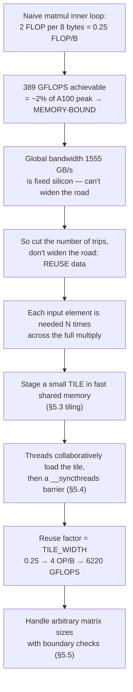
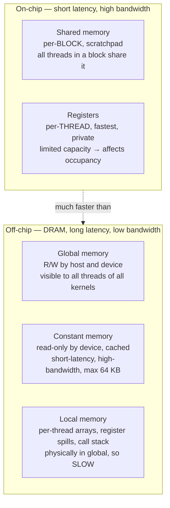

# PMPP Chapter 5 — Memory Architecture and Data Locality

*Complete summary: §5.1 → §5.5. The whole chapter is one argument — a problem
(§5.1), a toolbox (§5.2), and a solution (§5.3–5.5). Each section sets up the next.*

Running example throughout: `A` and `B` are the 4×4 matrix `1..16` (row-major); we
trace the single output cell **`P[2][1] = 356`** so every abstract idea lands on a
number you can check.

---

## 0. The whole chapter in one chain



> Keep this chain in your head. If any single section feels confusing, locate which
> arrow you're standing on — the confusion is almost always one arrow *earlier*.

---

## §5.1 — Importance of memory access efficiency

### The compute-to-global-memory-access ratio

Also called **arithmetic intensity** or **computational intensity**: the number of
FLOPs performed per byte fetched from global memory, within a region of a program.

For the naive matmul inner loop:

```c
for (int k = 0; k < Width; ++k)
    Pvalue += M[row*Width + k] * N[k*Width + col];
```

Per iteration:
- **2 global memory reads** — one `M` element, one `N` element — each a 4-byte
  `float` → **8 bytes**.
- **2 FLOPs** — one multiply, one add.

```
ratio = 2 FLOP / 8 B = 0.25 FLOP/B
```

### Why 0.25 is bad news (the A100)

- Peak global memory bandwidth ≈ **1555 GB/s**.
- Achievable compute = `1555 GB/s × 0.25 FLOP/B` = **389 GFLOPS**.
- A100 single-precision peak = **19,500 GFLOPS** → 389 is only **~2%**.
- With tensor cores (156,000 GFLOPS) it's **0.25%** of peak.

The math units sit idle ~98% of the time, starved for data. A kernel whose speed is
capped by memory bandwidth is **memory-bound**. (A kernel capped by the math units
is **compute-bound**.)

### Memory-bound vs compute-bound — the test

Every machine has a balance ratio = `peak FLOPS / peak bandwidth`. Compare the
kernel's intensity to it:

- kernel intensity **<** machine ratio → **memory-bound**
- kernel intensity **>** machine ratio → **compute-bound**

### The Roofline model (intuition)

A visual model plotting achievable performance against arithmetic intensity. The
"roof" has two parts: a slanted bandwidth-limited region (left, low intensity) and a
flat compute-limited region (right, high intensity). Tiling moves a kernel **right**
along the x-axis (higher intensity), lifting it off the slanted roof toward the flat
peak.

---

## §5.2 — CUDA memory types

### The hierarchy: on-chip (fast) vs off-chip (slow)



### Registers (per-thread, fastest)

Four reasons registers beat global memory:

1. **On-chip** → very short latency, drastically higher bandwidth. Aggregate
   register bandwidth across all SMs is ≥ 2 orders of magnitude above global.
2. **No global bandwidth consumed** → a value in a register doesn't spend off-chip
   bandwidth, raising the compute-to-global-access ratio.
3. **Fewer instructions** → arithmetic instructions have built-in register operands
   (`fadd r1, r2, r3`). A global operand needs an extra load first
   (`load r2, r4, offset` then `fadd`), and instructions/clock are limited.
4. **Lower energy** → reading the register file costs ≥ an order of magnitude less
   energy than a global access.

**Catch:** registers are scarce. Using too many per thread reduces **occupancy**
(threads schedulable per SM). Don't oversubscribe.

### Shared memory (per-block, the "scratchpad")

- On-chip, but **accessed via a load operation** (it's part of the address space),
  so it has *longer* latency / *lower* bandwidth than registers — yet *far* faster
  than global. In architecture terms it's a **scratchpad memory**.
- **Scope = a thread block.** All threads in a block see the same copy → it's how
  threads **cooperate**, sharing input data and intermediate results.
- An SM has multiple processing units; shared memory is built to be accessed
  simultaneously by them.

### Global, constant, local

- **Global:** large, slow, R/W by host and device, visible to all threads of all
  kernels, persists across kernel launches. Used to pass data between kernels and
  (with atomics) to collaborate across blocks. No easy cross-block sync except
  atomics or ending the kernel.
- **Constant:** read-only by the device, cached, short-latency/high-bandwidth with
  good access patterns. Declared **outside** any function body. Total ≤ **65,536
  bytes**. Good for kernel input values that never change.
- **Local:** "local" is a misnomer — it physically lives **in global memory**, so it
  has the same slow latency. It's just **per-thread private** (arrays that can't fit
  in registers, register spills, the call stack).

### Table 5.1 — variable declaration → memory / scope / lifetime

| Declaration | Memory | Scope | Lifetime |
|---|---|---|---|
| Automatic variables (non-array) | Register | Thread | Grid |
| Automatic array variables | Local | Thread | Grid |
| `__device__ __shared__ int SharedVar;` | Shared | Block | Grid |
| `__device__ int GlobalVar;` | Global | Grid | Application |
| `__device__ __constant__ int ConstVar;` | Constant | Grid | Application |

- **Scope** = the set of threads that can see the variable (one thread / one block /
  all grids).
- **Lifetime** = when it's available: *Grid* (must be declared in the kernel body;
  re-initialized each launch) vs *Application* (declared outside any function;
  persists across launches).
- **Scope counting rule:** automatic (scalar **or** array) = **per-thread**;
  `__shared__` = **per-block**. So a launch of `B` blocks × `T` threads makes
  `B×T` copies of an automatic, but only `B` copies of a shared variable.

### CPU vs GPU registers (sidebar)

- **CPU:** context switch saves the outgoing thread's registers to memory and
  restores the incoming thread's. Fixed register set per thread.
- **GPU:** zero-overhead scheduling — keeps the registers of *all* scheduled threads
  in the register file at once, so switching warps is instantaneous. Hence GPU
  register files are far larger, and support **dynamic partitioning** (few registers
  → many threads, or many registers → fewer threads).

---

## §5.3 — Tiling for reduced memory traffic

### The tradeoff and the tile analogy

Global memory is **large but slow**; shared memory is **small but fast**. Strategy:
partition the data into subsets called **tiles**, each sized to fit in shared
memory. (Analogy: a large wall = global data; small tiles = subsets that each fit
on-chip.)

**Criterion:** the kernel computation on the tiles must be doable **independently**
of each other. Not every data structure can be tiled for an arbitrary kernel.

### Locality

Each phase focuses on a small subset of the input, so a small shared memory can
serve most of the global accesses. This focused access behavior is **locality** —
the property that makes small fast memories worthwhile. (Just as important for
multicore CPUs, where the cache plays shared memory's role.)

### CPU caches vs GPU shared memory

Both keep reused data on-chip, but: CPUs keep it **implicitly** (hardware cache),
GPUs keep it **explicitly** (you write to shared memory). A CPU core runs 1–2
threads, so its cache reliably holds recent data. A GPU SM runs *many* threads that
compete for cache slots, making the cache unreliable — hence the explicit shared
memory for important reused data.

---

## §5.4 — The tiled matrix multiplication kernel

### Layer 1 — matrix multiplication itself

**One rule:** to fill `P[i][j]`, dot **row `i` of A** with **column `j` of B** —
multiply position-by-position, sum the products.

```
        A (4x4)              B (4x4)             P = A·B
   row0:  1  2  3  4    col1 = 2,6,10,14    each P[i][j] =
   row1:  5  6  7  8                          (row i of A) · (col j of B)
 > row2:  9 10 11 12
   row3: 13 14 15 16

   P[2][1] = 9·2 + 10·6 + 11·10 + 12·14 = 18 + 60 + 110 + 168 = 356
```

Geometric view — A on the left, B on top, P bottom-right; row of A slides right,
column of B slides down, they collide at `P[i][j]`:

```
                      B  (col 1 ↓)
                      |
                      v
       A  ----->  +---------+
   (row 2 →)      | P[2][1] | = 356
                  +---------+
```

**Two properties that justify everything above:**
1. Every cell is computed the same way, from its own row and column.
2. No cell depends on any other → all 16 can be computed **simultaneously**.

### Layer 2 — threads (one thread owns one P cell)

Because cells are independent, hand each to its own thread. Same code, different
badge:

```
              P — one thread per cell
   +-----------+-----------+-----------+-----------+
   | row0 col0 | row0 col1 | row0 col2 | row0 col3 |
   +-----------+-----------+-----------+-----------+
   | row1 col0 | row1 col1 | row1 col2 | row1 col3 |
   +-----------+-----------+-----------+-----------+
   | row2 col0 |[row2 col1]| row2 col2 | row2 col3 |  → coral thread = 356
   +-----------+-----------+-----------+-----------+
   | row3 col0 | row3 col1 | row3 col2 | row3 col3 |
   +-----------+-----------+-----------+-----------+
```

```c
int row = by * TILE_WIDTH + ty;   // which P row I own  (y → row, vertical)
int col = bx * TILE_WIDTH + tx;   // which P col I own  (x → col, horizontal)
```

- The **badge** is the thread's coordinate (`by, ty`); `× TILE_WIDTH` turns it into
  a *jump* (skip whole blocks), then `ty`/`tx` is the *offset* inside the block.
- **Block shape comes from the host launch, not the kernel:**
  ```c
  dim3 blockDim(TILE_WIDTH, TILE_WIDTH);            // TILE_WIDTH² threads, one per tile cell
  dim3 gridDim(N / TILE_WIDTH, N / TILE_WIDTH);     // enough blocks to cover all of P
  ```
  The kernel silently assumes it was launched this way — the invisible handshake.

### Layer 3 — tiles + the k-loop

A thread's dot product is length `N` (full row · full column), but a tile holds only
`TILE_WIDTH` values. So it's done in **`N / TILE_WIDTH` phases**, `TILE_WIDTH`
products per phase, each value pulled from the fast shared tile.

```
   coral thread's dot product (length 4), chopped into 2 phases (TILE_WIDTH = 2):

   9·2 + 10·6  |  11·10 + 12·14
   \_ phase 0 _/  \__ phase 1 __/

   phase 0:  load tile (row→ 9,10  col↓ 2,6);  Pvalue += 9·2 + 10·6      = 78
   phase 1:  load tile (row→ 11,12 col↓ 10,14); Pvalue += 11·10 + 12·14  = 356
```

**Two loops, two jobs (don't merge them):**
- **Outer `ph` loop = TIME** — steps to the next tile/phase. `phases = N/TILE_WIDTH`.
- **Inner `k` loop = the products WITHIN one phase** — does zero loading; reads the
  already-filled shared tile.

> Phases are **time**; blocks are **space**. One thread marches through phases
> sequentially to finish its own one cell.

**Collaborative loading:** each thread loads *one* M and *one* N element into its
`[ty][tx]` slot; the other slots are filled by the block's other threads. After the
barrier the whole tile is full and every thread reads every cell — that's the reuse.

### The flat index (row-major)

A 2D matrix is a 1D array: `flat = row * Width + col`. In tiling, each of row/col
splits into a per-phase jump + a per-thread offset:

```c
// M slides RIGHT across its row → phase jump lands on the COLUMN (bare term)
Mds[ty][tx] = M[ row * Width  +  (ph*TILE_WIDTH + tx) ];

// N slides DOWN its column → phase jump lands on the ROW (gets the × Width)
Nds[ty][tx] = N[ (ph*TILE_WIDTH + ty) * Width  +  col ];
```

The asymmetry (M's moving term is the column; N's is the row) **is** "M slides right,
N slides down" in code.

### The full kernel, line-by-line

```c
#define TILE_WIDTH 16

__global__ void matmulKernel(float* M, float* N, float* P, int Width) {
    int bx = blockIdx.x;  int by = blockIdx.y;
    int tx = threadIdx.x; int ty = threadIdx.y;

    int row = by * TILE_WIDTH + ty;          // which P cell I own (y→row)
    int col = bx * TILE_WIDTH + tx;          //                    (x→col)

    __shared__ float Mds[TILE_WIDTH][TILE_WIDTH];   // block's tiles (per-block)
    __shared__ float Nds[TILE_WIDTH][TILE_WIDTH];

    float Pvalue = 0.0f;                     // private accumulator (OUTSIDE loop → survives)

    for (int ph = 0; ph < Width / TILE_WIDTH; ++ph) {   // OUTER: step to next phase
        Mds[ty][tx] = M[row*Width + (ph*TILE_WIDTH + tx)];   // collaborative load
        Nds[ty][tx] = N[(ph*TILE_WIDTH + ty)*Width + col];
        __syncthreads();                     // BARRIER 1: wait till tile is FULL (read-after-write)

        for (int k = 0; k < TILE_WIDTH; ++k)             // INNER: products in this phase
            Pvalue += Mds[ty][k] * Nds[k][tx];

        __syncthreads();                     // BARRIER 2: wait till all DONE reading (write-after-read)
    }
    P[row*Width + col] = Pvalue;             // write my one finished cell home
}
```

### The two barriers (the only subtle part)


- **Barrier 1 (after load, before read)** — *read-after-write* / true dependence.
  Without it, a fast thread reads a slot a slow thread hasn't written → garbage.
- **Barrier 2 (after read, before next load)** — *write-after-read* / false
  dependence. Without it, a fast thread overwrites the tile with the next phase
  while a slow thread is still reading the current one → corrupted partial sum.
- Drop both → results are wrong, and *nondeterministically* so (timing-dependent),
  which is the worst kind of bug.

### The payoff (reuse factor = TILE_WIDTH)

A `T×T` tile costs `T²` global loads but is read `T²·T` times → each value is reused
**T** times. So global accesses drop by a factor of **TILE_WIDTH** (the edge, not
the area — the squares cancel). With `T = 16`: `0.25 × 16 = 4 OP/B`, lifting the
A100 ceiling from 389 to **6220 GFLOPS** (~32% of peak). Still not peak — but a 16×
improvement. Production libraries (**cuBLAS**, **CUTLASS**) push further.

### Strip-mining (the technique behind the two loops)

The loop nest (outer `ph` + inner `k`) is **strip-mining**: take one long-running
loop (the length-`Width` dot product) and break it into phases, each an inner loop of
a few consecutive iterations, with barriers forcing the whole block onto the same
data per phase. Long used on CPUs for cache tiling and vectorization.

---

## §5.5 — Boundary checks (handling arbitrary sizes)

### The two simplifying assumptions §5.4 made

1. **Width is a multiple of the tile width** — otherwise `Width / TILE_WIDTH`
   truncates and the last partial tile is never processed.
2. **The matrices are square.**

§5.5 removes assumption 1 (arbitrary width). Example: 3×3 matrices with `TILE_WIDTH
= 2` (3 is not a multiple of 2).

### The problem: accessing nonexistent elements

When `Width` isn't a multiple of `TILE_WIDTH`, the last phase has threads whose
indices run **past the edge** of M or N. Two distinct failures:

1. **Reading past the end of a row** (M): the flat index `row*Width + col` with an
   out-of-range `col` silently lands on the *wrong* element (the start of the next
   row, or beyond the array) — wrong data, not an error.
2. **Reading past the last row** (N) or **writing a P cell that doesn't exist** —
   out-of-bounds memory access.

### The fix: two separate guards + a "load 0, don't skip" rule

There are **two different boundary conditions**, and they are not the same check:

- A guard on the **element you load** (is this input in range?) → if not, load `0.0`.
- A guard on the **element you write** (does my P cell exist?) → if not, don't write.

**Critical subtlety:** a thread whose load is out of bounds must still **store 0 into
the tile AND still call `__syncthreads()`** — it must not `continue`/skip. If it
skipped, it would (a) leave a stale value in the shared tile that corrupts its
neighbors' dot products, and (b) fail to reach the barrier → deadlock the block. The
`0` it stores contributes nothing to any dot product, so correctness is preserved.

```c
// phase loop now uses CEILING so the partial last tile is covered
for (int ph = 0; ph < ceil(Width / (float)TILE_WIDTH); ++ph) {

    // load guard for M
    if (row < Width && (ph*TILE_WIDTH + tx) < Width)
        Mds[ty][tx] = M[row*Width + ph*TILE_WIDTH + tx];
    else
        Mds[ty][tx] = 0.0f;                 // out of bounds → 0, NOT skip

    // load guard for N
    if ((ph*TILE_WIDTH + ty) < Width && col < Width)
        Nds[ty][tx] = N[(ph*TILE_WIDTH + ty)*Width + col];
    else
        Nds[ty][tx] = 0.0f;

    __syncthreads();                        // every thread reaches this — even OOB ones

    for (int k = 0; k < TILE_WIDTH; ++k)
        Pvalue += Mds[ty][k] * Nds[k][tx];
    __syncthreads();
}

// write guard — only real P cells get written
if (row < Width && col < Width)
    P[row*Width + col] = Pvalue;
```

(The grid launch also switches to ceiling division so enough blocks exist:
`gridDim((Width + TILE_WIDTH - 1)/TILE_WIDTH, ...)`. Assumption 2, non-square
matrices, is handled by giving M, N, P their own dimensions — the I/K/J
generalization.)

---

## Mental anchors (the things easy to get wrong)

- **The seed:** one thread produces **one full element of P** (a whole dot product),
  not "one product." No sum → no k-loop.
- **Private ≠ can't accumulate.** `Pvalue` is a private register; it still
  accumulates across *its own* iterations. Shared **input** (tiles), private
  **output** (`Pvalue`). There is no collective accumulator — 16 threads, 16
  independent jars.
- **`Pvalue` outside the loop = it survives** (78 → 356). Inside, it'd reset every
  phase and keep only the last.
- **Phases = time, blocks = space.** Don't conflate.
- **Reduction factor = tile EDGE (T), not area (T²).** The squares cancel.
- **Scope counting:** automatic (scalar or array) = per-thread; `__shared__` =
  per-block.
- **Bits → bytes is ÷8** (32-bit = 4 bytes), not ×4.
- **Integer division truncates**, it doesn't round; the ceiling formula
  `(N + T - 1)/T` does the rounding-up.
- **Out-of-bounds threads still load 0 and still hit `__syncthreads()`** — never
  skip (corruption + deadlock).

---

## Key formulas / facts reference

| Thing | Formula / value |
|---|---|
| Naive matmul intensity | 2 FLOP / 8 B = **0.25 FLOP/B** |
| Achievable GFLOPS | `bandwidth (GB/s) × intensity (FLOP/B)` |
| Memory- vs compute-bound | kernel intensity `<` vs `>` `peakFLOPS/bandwidth` |
| Bytes per 32-bit access | 4 bytes |
| Naive global requests / element | `N` |
| Tiled global requests / element | `N / T` |
| Reuse / bandwidth reduction factor | `TILE_WIDTH` (the edge T) |
| Phases in tiled matmul | `Width / TILE_WIDTH` (ceil if not a multiple) |
| Block shape (tiled matmul) | `TILE_WIDTH × TILE_WIDTH` threads |
| Constant memory cap | 65,536 bytes |
| Versions of an automatic var | `blocks × threads_per_block` |
| Versions of a `__shared__` var | `blocks` |
| Shared mem per block | sum of `__shared__` sizes (e.g. `129 floats × 4 B = 516 B`) |

---

## Section map

| § | Title | One-line takeaway |
|---|-------|-------------------|
| 5.1 | Memory access efficiency | Naive matmul is 0.25 FLOP/B → memory-bound at ~2% of peak. |
| 5.2 | CUDA memory types | On-chip (registers/shared) fast; off-chip (global/local/constant) slow; scope & lifetime per Table 5.1. |
| 5.3 | Tiling for reduced traffic | Partition data into tiles that fit in shared memory; locality makes small fast memory pay off. |
| 5.4 | The tiled kernel | Collaborative load + 2 barriers + k-loop → reuse factor TILE_WIDTH (0.25 → 4 OP/B). |
| 5.5 | Boundary checks | Two guards (load → 0, write → skip); OOB threads still load 0 and still sync. |
