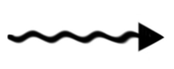
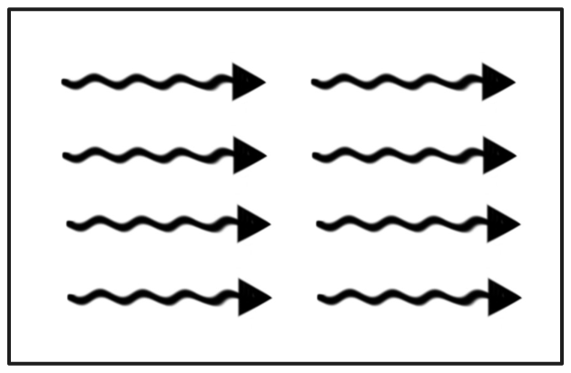
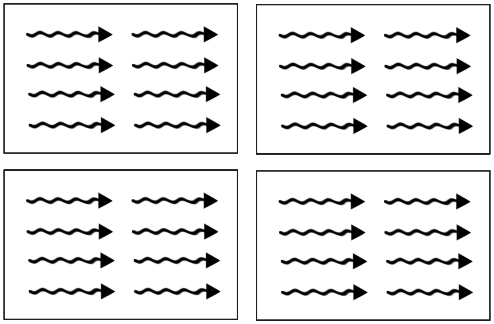

## This readme covers all the basic topics required.

## Threads
- Single execution units that run kernels on the GPU.
- Similar to CPU threads but there's usually many more of them.
- They are sometimes drawn as wavy arrow 





## Thread Blocks
- Thread blocks are a collection of threads.
- All the threads in any single thread block can communicate.





## Grid
- A kernel is launched as a collection of thread blocks called the grid.
- The grid is a collection of thread blocks, each fo which is a collection of threads!




## dim3 Data Type

`dim3` is a 3D structure (or vector type) with three integer components: `x`, `y`, and `z`. You can initialize one, two, or all three coordinates. When a coordinate is not provided, it defaults to `1`.

```cpp
dim3 threads(256);           // x = 256, y = 1, z = 1
dim3 blocks(100, 100);       // x = 100, y = 100, z = 1
dim3 anotherOne(10, 54, 32); // x = 10, y = 54, z = 32
```

### Notes

- `dim3` is commonly used in CUDA to define block and grid dimensions.
- If only `x` is given, both `y` and `z` are automatically set to `1`.
- If `x` and `y` are given, `z` is automatically set to `1`.