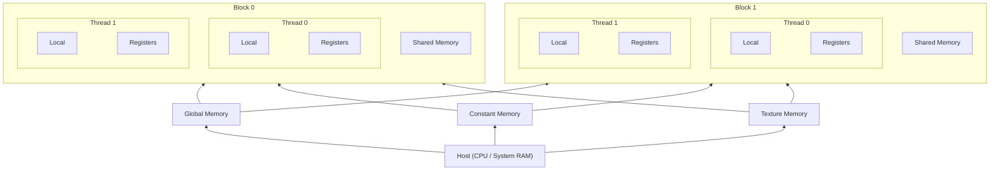
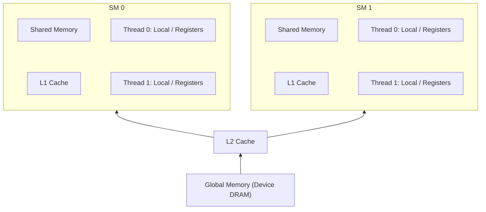
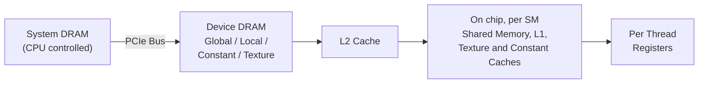

# CUDA Memory Hierarchy

Notes on the different memory spaces in a CUDA GPU. Just like a CPU has RAM, registers, and disk, the GPU has several distinct memory spaces. Each one has its own access permissions, scope, lifetime, and speed, and choosing the right one for the job is most of what GPU performance optimization is about.

CUDA programming is essentially a strategy game: the rule book is a mile thick and the enemy is poor performance. These notes cover the rules.

## Contents

- [Overview](#overview)
- [Global Memory](#global-memory)
- [Local Memory](#local-memory)
- [Caches (L1 and L2)](#caches-l1-and-l2)
- [Constant Memory](#constant-memory)
- [Texture Memory](#texture-memory)
- [Shared Memory](#shared-memory)
- [Registers](#registers)
- [Summary Table](#summary-table)
- [Physical Layout and Speed](#physical-layout-and-speed)
- [Profiling Tools](#profiling-tools)

## Overview

The logical memory model from the perspective of threads and blocks:

Key takeaways from this picture:

- Registers and local memory are private to a single thread.
- Shared memory is private to a block and visible to every thread in that block.
- Global, constant, and texture memory are visible to all threads on the device, and the CPU can read and write them across the PCIe bus.

## Global Memory

Global memory is the main memory store of the GPU. There is a lot of it (the entire VRAM pool, minus reserved space), every byte is addressable, and it is persistent across kernel launches.

- All running threads can read and write it, and so can the CPU.
- It is the slowest memory space to access compared to shared memory and registers.
- `cudaMalloc`, `cudaFree`, `cudaMemcpy`, and `cudaMemset` all operate on global memory.
- On compute capability 2.0 and higher, global memory accesses are cached (L2, and optionally L1).

The single most important performance rule for global memory is **coalescing**: threads in a warp should access consecutive addresses so the hardware can service the warp with as few memory transactions as possible.

## Local Memory

Local memory is, somewhat confusingly, not local at all physically. It lives in the same device DRAM as global memory, so it is just as slow to reach.

It is used automatically by the compiler (NVCC) when registers run out or cannot be used. This is called **register spilling**. It happens when:

- A kernel uses too many variables per thread to fit in registers.
- A kernel uses structures that do not fit in registers.
- Arrays are indexed with non-constant (runtime) indices. Registers do not have addresses, so any array that needs dynamic indexing must live in an addressable memory space.

The scope of local memory is per thread. Local memory is cached in L1 and then L2, so register spilling does not always mean a dramatic performance hit on compute capability 2.0 and up, but it is still something to watch for. You can see spills at compile time with `nvcc -Xptxas -v`.

## Caches (L1 and L2)

- There is an **L1 cache per SM** (streaming multiprocessor) and a single **L2 cache shared by all SMs**.
- Global and local memory accesses go through these caches. In fact, all global memory traffic goes through L2, including accesses made by the CPU.
- The L1 is very fast, at shared memory speeds. The L1 and shared memory are physically the same SRAM. On older architectures (Fermi) you could split it explicitly as 48 KB shared / 16 KB L1 or 16 KB shared / 48 KB L1. On modern architectures (Volta and later, including Ada) it is a unified pool with a configurable shared memory carveout set via `cudaFuncSetAttribute`.
- Caching behavior can be adjusted with compiler options (for example `-Xptxas -dlcm=cg` to bypass L1 for global loads).
- Texture and constant memory have their own separate caches, independent of the L1/L2 used by global memory.

## Constant Memory

Constant memory is part of device DRAM, but it has its own dedicated cache, unrelated to the L1 and L2 used by global memory.

- All threads can read it, but no thread can write it. The CPU sets the values before launching the kernel (`__constant__` qualifier plus `cudaMemcpyToSymbol`).
- It is small: only **64 KB** of constant memory per device.
- It is very fast (register and shared memory speeds) **if all threads in a warp read exactly the same address**. The constant cache broadcasts a single value to the whole warp. If threads in a warp read different addresses, the accesses are serialized and performance falls off quickly.
- Classic use case in graphics: model, view, and projection matrices. In compute kernels: small lookup tables, filter coefficients, configuration parameters that every thread reads identically.

## Texture Memory

Texture memory also resides in device DRAM (like global, local, and constant memory) and has its own dedicated cache, separate per SM.

- It is read-only from the GPU side; the CPU sets it up.
- It exists because graphics needs special addressing: texture fetching provides hardware-accelerated 2D spatial locality, address clamping/wrapping, and interpolation between pixels essentially for free.
- The texture cache historically has lower bandwidth than global memory's L1, so for plain linear reads it is often better to stick with L1. Texture wins when access patterns have 2D locality or when you want the free interpolation.

One subtlety: because texture memory is really just global memory underneath, you can technically write to the underlying buffer while threads run. But the texture cache is not coherent within a kernel launch. If one thread writes the global memory and another thread reads through the texture path in the same kernel, whether it sees the old cached copy or the new value is **undefined**. The safe pattern is to write in one kernel and read through textures in a subsequent kernel.

## Shared Memory

Shared memory is very fast, at register speeds. It is shared between all threads of a block and is the primary mechanism for fast inter-thread communication within a block.

- Declared with the `__shared__` qualifier inside a kernel.
- Lifetime is the lifetime of the block.
- Physically, shared memory and the L1 cache of an SM are the same bytes.

The main hazard is **bank conflicts**. Shared memory is divided into banks, and successive 4-byte words (dwords) reside in successive banks. There are 32 banks on every modern architecture (16 on the ancient compute capability 1.x). Access is fastest when:

- All threads of a warp read from different banks, or
- All threads of a warp read exactly the same value (broadcast).

If multiple threads hit different addresses in the same bank, those accesses serialize. The classic fix for strided access patterns is padding the array by one element per row.

## Registers

Registers are the fastest memory on the GPU. Variables declared inside a kernel live in registers unless the compiler runs out or the variable cannot be stored in one, in which case it spills to local memory.

- Scope is per thread.
- Unlike a CPU, a GPU has **thousands of registers per SM** (65,536 32-bit registers on most modern architectures).

Register count directly affects **occupancy**. The register file on each SM is shared among all resident threads, so a kernel that uses 50 registers per thread allows far fewer concurrent blocks than one that uses a handful. Carefully trimming register usage can easily double the number of concurrent blocks the SM can execute. SMs can host up to 16 or more resident blocks if resource usage allows it. You can cap register usage with `__launch_bounds__` or `-maxrregcount`, at the risk of forcing spills.

## Summary Table

| Memory    | Access | Scope               | Lifetime    | Speed        | Notes                          |
|-----------|--------|---------------------|-------------|--------------|--------------------------------|
| Global    | RW     | All threads + CPU   | Application | Slow, cached | Large; coalesce accesses       |
| Constant  | R      | All threads + CPU   | Application | Slow, cached | Fast if warp reads same address |
| Texture   | R      | All threads + CPU   | Application | Slow, cached | Addressing and filtering perks |
| Local     | RW     | Per thread          | Thread      | Slow, cached | Register spilling lands here   |
| Shared    | RW     | Per block           | Block       | Fast         | Inter-thread communication; mind the banks |
| Registers | RW     | Per thread          | Thread      | Fastest      | Do not use too many            |

## Physical Layout and Speed

Where everything actually lives, from slowest to fastest:

Moving left to right, capacity shrinks and speed grows by roughly an order of magnitude at each step. The PCIe hop between system RAM and device DRAM is by far the most expensive, which is why minimizing host-device transfers is rule number one of CUDA performance.

## Profiling Tools

These memories are each suited to different tasks, and the profiler is how you find out whether your strategy is working. NVIDIA's tools will tell you exactly how you are doing, and they are not shy about it.

- **Nsight Compute** (`ncu`): kernel-level profiling. Shows memory throughput per space, cache hit rates, bank conflicts, occupancy, and register usage. This is the modern replacement for the old Visual Profiler / `nvprof`, which are deprecated.
- **Nsight Systems** (`nsys`): timeline-level profiling. Shows kernel launches, memcpy traffic over PCIe, and CPU/GPU overlap.
- **`nvcc -Xptxas -v`**: prints register usage, shared memory usage, and spill counts per kernel at compile time.

## References

- "What's a Creel?" CUDA series: CUDA Memories tutorial
- NVIDIA CUDA C++ Programming Guide, Memory Hierarchy section
- Programming Massively Parallel Processors (Kirk and Hwu), chapters on memory and data locality
