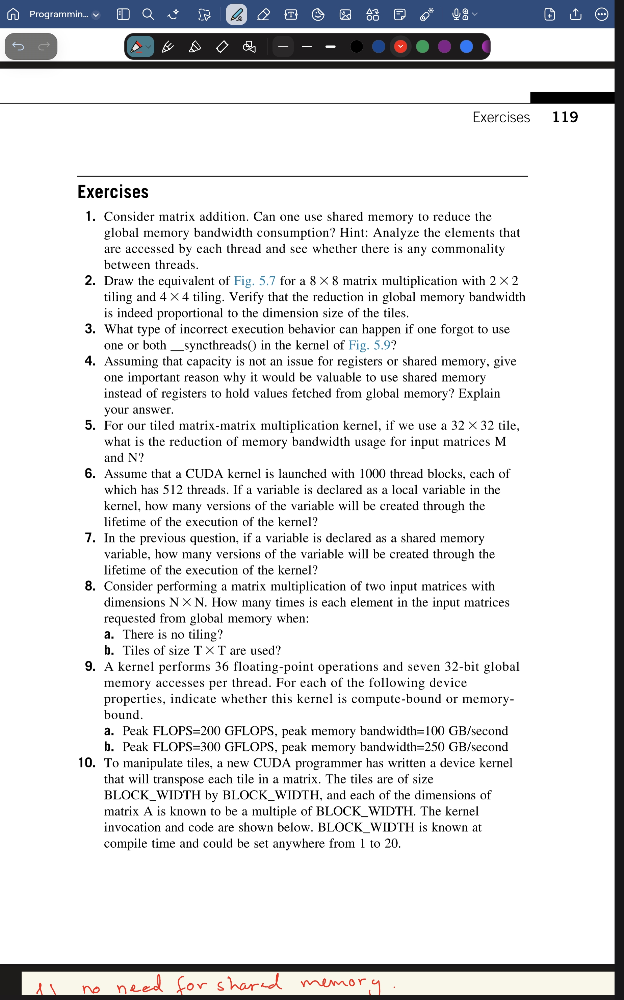
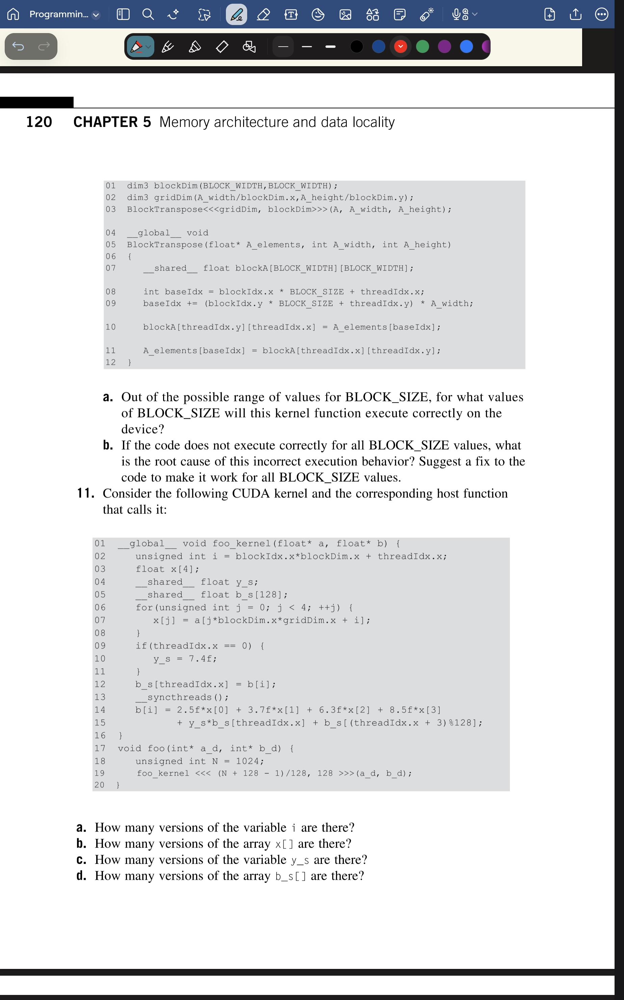
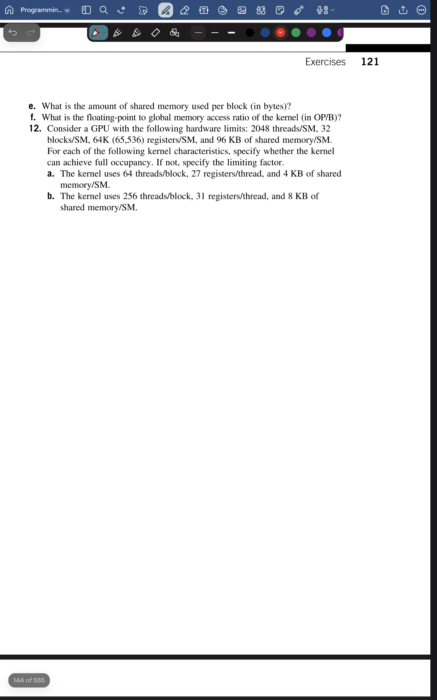

## All these answers were answered by me (vraj) and then just claude rewrote them with better flow and understandingg.


# PMPP Chapter 5 — Exercise Solutions

*Memory architecture and data locality. Worked through by reasoning, not lookup.*

The question images are in `./ch5_exercise_images/`. Each answer states the
**verdict**, the **reasoning**, and (where I slipped on the first pass) the
**common trap** so the correction sticks.

> **Two patterns that run through almost every question here:**
> 1. **Scope counting** — an *automatic* variable (scalar **or** array) is
>    **per-thread**; a `__shared__` variable is **per-block**. Multiply by the
>    right population.
> 2. **Bound / occupancy** — compute one ratio (or resource tally) at a time,
>    compare to its ceiling; the *smallest* allowed count wins.

---

## Question images






---

## Q1 — Shared memory for matrix *addition*?

**Verdict: No — shared memory gives no benefit for matrix addition.**

Matrix addition is `C[i][j] = A[i][j] + B[i][j]`. Trace a single input element,
say `A[2][1]`: only `C[2][1]` ever reads it. No other output cell touches it. So
each input element is read from global memory **exactly once** — reuse count = 1.

Shared memory only helps when a value is fetched **more than once**: you cache it
on the first fetch and serve the reuses fast. With reuse = 1 there is nothing to
amortize. Worse, staging it through shared memory would replace one direct global
load with a load *into* shared plus a load *out* of shared — strictly slower.

Contrast with multiplication, where `A[2][1]` feeds an entire row of P (reused N
times) — *that* reuse is what justifies tiling.

---

## Q2 — Fig 5.7 equivalent for 8×8 matmul, 2×2 and 4×4 tiling

**Verdict: 2×2 tile → reduction factor 2. 4×4 tile → reduction factor 4. The
reduction is proportional to the tile's *edge length*, not its area.**

Why the edge, not the area — count it for a `T×T` tile:

- Loads to fill the tile: `T²` (one global load per cell).
- Reads served during the k-loops: `T² × T` (`T²` threads each read `T` values).
- Reuse = reads / loads = `T²·T / T² = T`.

The squares cancel, leaving **T** (the edge length).

> **Trap I hit:** I first guessed the factor was the *area* (2×2 → 4). It's the
> edge. The bigger tile gives the bigger reduction, which makes sense: a wider tile
> means each loaded value is reused more times before going back to global memory.
> Matches §5.4's statement that 16×16 tiles turn 0.25 OP/B into 4 OP/B (factor 16).

---

## Q3 — Forgetting `__syncthreads()` in the Fig 5.9 kernel

There are two barriers doing two different jobs.

- **Drop barrier 1** (after the load, before the k-loop): a fast thread reads tile
  slots that a slow thread hasn't written yet → reads stale garbage.
  This is a **read-after-write (true) dependence** violation.

- **Drop barrier 2** (after the k-loop, before the next phase's load): a fast
  thread that finished reading races into the next phase and **overwrites** the
  tile while a slow thread is *still reading the current phase* → the slow thread's
  partial sum is corrupted with next-phase data.
  This is a **write-after-read (false) dependence** violation.

- **Drop both:** both races fire. Results are wrong — and *nondeterministically*
  wrong (depends on thread timing), so the kernel may even look correct sometimes.
  That intermittence is what makes a missing barrier so hard to debug.

---

## Q4 — Why use shared memory instead of registers (capacity aside)?

**Reason: shared memory is visible to the whole block; a register is private to one
thread.** That sharing lets a value used by many threads be loaded from global
memory **once** (into the shared tile) and then read by all of them — instead of
each thread independently re-fetching the same value from global, which is what
private registers would force.

So the win is **fewer redundant global loads**, not raw access speed. (A register
is actually the *fastest* store there is — but its privacy means N threads needing
the same value cause N global loads. Shared memory turns that into 1.) This is
exactly the collaborative-load argument: 16 loads fill a tile that serves 64 reads.

---

## Q5 — 32×32 tile, reduction for M and N?

**Reduction factor = 32** (the tile edge length, same rule as Q2). Each M and N
element loaded from global memory is reused 32 times, so input global-bandwidth
usage drops by a factor of **32**.

---

## Q6 — 1000 blocks × 512 threads, a *local* variable

**512,000 versions.**

A local/automatic variable has **per-thread** scope (Table 5.1: scalar automatics →
register, automatic arrays → local memory — either way, scope = thread). One private
copy per thread:

```
512 threads/block × 1000 blocks = 512,000
```

---

## Q7 — Same launch, a *shared* variable

**1000 versions.**

A `__shared__` variable has **per-block** scope — one copy per block, shared by all
512 threads in it. So the thread count is irrelevant here:

```
1000 blocks → 1000 versions
```

(The Q6 vs Q7 contrast — 512,000 vs 1000 from the *same* launch — is the entire
scope hierarchy in two numbers.)

---

## Q8 — N×N matmul: how many times is each input element requested from global?

- **(a) No tiling: N times.** A single element (e.g. in row 2 of M) is needed by
  every output cell in that row of P. A row of P has N columns → requested **N**
  times. *(Not N² — that's the trap; it's one row's worth of reuse, not the whole
  matrix.)*

- **(b) T×T tiles: N / T times.** Apply the factor-of-T reduction from Q2/Q5 to the
  naive count: `N / T`.

---

## Q9 — Compute-bound or memory-bound? (36 FLOPs, seven 32-bit accesses)

**Kernel arithmetic intensity first:**

- 32-bit access = `32 / 8 = 4 bytes` *(bits → bytes is ÷8, not ×4 — the trap)*.
- 7 accesses × 4 bytes = **28 bytes**.
- Intensity = `36 FLOP / 28 B ≈ 1.29 OP/B`.

**Compare to each machine's balance ratio (peak FLOPS ÷ peak bandwidth):**

- **(a)** `200 / 100 = 2.0`. Kernel `1.29 < 2.0` → **memory-bound** (data can't
  arrive fast enough to keep the math units fed).
- **(b)** `300 / 250 = 1.2`. Kernel `1.29 > 1.2` → **compute-bound** (math is the
  bottleneck; data arrives with room to spare).

> Rule: kernel intensity **below** the machine ratio = memory-bound; **above** =
> compute-bound.

---

## Q10 — Transpose kernel, missing barrier, BLOCK_SIZE 1–20

The kernel writes `blockA[ty][tx]` (line 10) then reads `blockA[tx][ty]` (line 11) —
**indices swapped (the transpose)** — with **no `__syncthreads()` between them.**

- **(a) Executes correctly only for BLOCK_SIZE = 1.**
  The missing barrier is harmless only if every thread reads a slot **it itself
  wrote** — i.e. `[tx][ty] == [ty][tx]`, which requires `tx == ty` for all threads.
  - BLOCK_SIZE = 1: the single thread is `(0,0)` → writes `[0][0]`, reads `[0][0]`.
    No cross-thread dependency. **Works.**
  - BLOCK_SIZE ≥ 2: off-diagonal threads exist. Thread `(x=1, y=0)` writes
    `blockA[0][1]` but reads `blockA[1][0]` — written by a *different* thread → race.
    **Breaks.**

  > Trap: powers of two (2, 4, 8, 16) are exactly the cases that **break** — they all
  > have off-diagonal threads. Only the trivial 1×1 block is safe.

- **(b) Root cause + fix.**
  **Root cause:** read-after-write race — line 11 reads `blockA` slots written by
  other threads, with no barrier guaranteeing those writes finished.
  **Fix:** insert `__syncthreads()` **between line 10 and line 11**:

  ```c
  blockA[threadIdx.y][threadIdx.x] = A_elements[baseIdx];   // write
  __syncthreads();                                          // <-- fix
  A_elements[baseIdx] = blockA[threadIdx.x][threadIdx.y];   // read (transposed)
  ```

  With the barrier it works for all BLOCK_SIZE 1–20.

---

## Q11 — `foo_kernel`, launched with N = 1024, 128 threads/block

Launch config: `(N + 128 - 1) / 128 = (1024 + 127) / 128 = 1151/128 = 8` blocks
(integer division **truncates**, it does not round up; 1024 is a clean multiple of
128). So **8 blocks × 128 threads = 1024 threads** total.

| Part | Variable | Declaration | Scope | Versions |
|------|----------|-------------|-------|----------|
| (a) | `i` | `unsigned int i` (automatic scalar) | per-thread | **1024** |
| (b) | `x[]` | `float x[4]` (automatic array) | per-thread | **1024** |
| (c) | `y_s` | `__shared__ float y_s` | per-block | **8** |
| (d) | `b_s[]` | `__shared__ float b_s[128]` | per-block | **8** |

> Trap: an array is **not** automatically block-scoped. `x[4]` has no qualifier →
> it's a per-thread automatic, just like the scalar `i`. Only `__shared__` is
> per-block. (Also: the `128` in `b_s[128]` is the array *length*, not the version
> count — don't let it tempt you.)

- **(e) Shared memory per block:** only `__shared__` declarations count.
  `(1 float for y_s) + (128 floats for b_s)` `= 129 floats × 4 bytes` = **516 bytes**.
  *(Independent of thread count — shared memory is per-block.)*

- **(f) Floating-point to global access ratio:**
  - **FLOPs (lines 14–15):** five multiplies (`2.5f*x[0]`, `3.7f*x[1]`, `6.3f*x[2]`,
    `8.5f*x[3]`, `y_s*b_s[...]`) + five adds joining the six terms = **10 FLOPs**.
  - **Global accesses:** only `a[]` and `b[]` are global (`x[]` is local; `y_s`,
    `b_s[]` are shared). The `a[]` read on line 07 is inside the `for (j=0; j<4)`
    loop → **4 reads**, plus the **1 write** to `b[i]` on line 14 = **5 accesses**
    × 4 bytes = **20 bytes**.
  - Ratio = `10 / 20` = **0.5 OP/B**.

---

## Q12 — Occupancy

SM hardware limits: **2048 threads, 32 blocks, 65,536 registers, 96 KB shared.**
Method: to target full occupancy (2048 threads), find the blocks needed, then check
every resource against its ceiling. The smallest allowed count wins.

### (a) 64 threads/block, 27 registers/thread, 4 KB shared/block

- Blocks for 2048 threads: `2048 / 64 = 32` blocks. Block limit is 32 → **exactly OK.**
- Registers: `32 × 64 × 27 = 55,296 < 65,536` → **OK.**
- Shared memory: `32 × 4 KB = 128 KB > 96 KB` → **FAILS.**

**Limiting factor: shared memory.** With 96 KB you can fit only `96 / 4 = 24` blocks
→ `24 × 64 = 1536` threads = **75% occupancy** (not full).

> Trap: don't stop at "64 threads/block." 2048/64 = 32 blocks (not 64), which *fits*
> the block ceiling — you have to push through registers and shared memory to find
> that shared memory is the real bottleneck.

### (b) 256 threads/block, 31 registers/thread, 8 KB shared/block

- Blocks for 2048 threads: `2048 / 256 = 8` blocks. `8 < 32` → **OK.**
- Registers: `8 × 256 × 31 = 63,488 < 65,536` → **OK** (just barely).
- Shared memory: `8 × 8 KB = 64 KB < 96 KB` → **OK.**

**All three pass → full occupancy (2048 threads/SM).**

> Per-SM limits + per-block allocation: always multiply per-block usage × number of
> blocks before comparing to the SM ceiling.

---

## One-line recap of every answer

| Q | Answer |
|---|--------|
| 1 | No — addition reuses each element once; shared memory needs reuse > 1. |
| 2 | 2×2 → factor 2, 4×4 → factor 4 (proportional to tile edge T, not T²). |
| 3 | Drop barrier 1 → read-after-write garbage; drop barrier 2 → write-after-read corruption; nondeterministic wrong results. |
| 4 | Shared memory is block-visible, so a shared value is loaded once instead of once-per-thread (registers can't share). |
| 5 | Factor of 32. |
| 6 | 512,000 (per-thread). |
| 7 | 1000 (per-block). |
| 8 | (a) N, (b) N/T. |
| 9 | Intensity ≈ 1.29 OP/B; (a) memory-bound, (b) compute-bound. |
| 10 | (a) only BLOCK_SIZE = 1; (b) read-after-write race, fix with `__syncthreads()` between write and read. |
| 11 | (a) 1024, (b) 1024, (c) 8, (d) 8, (e) 516 bytes, (f) 0.5 OP/B. |
| 12 | (a) limited by shared memory (1536 threads, 75%); (b) full occupancy. |
